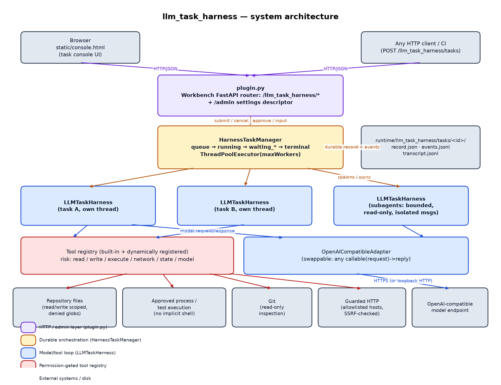

# 01 — Architecture

## Layering

`coplex_stdpy` is split into three layers inside one plugin directory.
Each layer only ever calls the layer directly below it:

- `plugin.py` never touches an `LLMTaskHarness` instance directly — only
  `HarnessTaskManager`'s public methods (`submit`, `list`, `get`, `events`,
  `cancel`, `decide_approval`, `provide_input`, `capabilities`, `models`).
- `HarnessTaskManager` never touches FastAPI, HTTP, or the Workbench
  manifest — it only constructs and drives `LLMTaskHarness` instances and
  persists JSON/JSONL to disk.
- `LLMTaskHarness` never touches the task manager or HTTP — it only knows
  about its own repository root, its tool registry, and the `adapter`
  callable it was constructed with.

```
plugin.py (FastAPI router + admin descriptor)
    -> HarnessTaskManager (durable async orchestration)
        -> LLMTaskHarness (one per task, one per subagent)
            -> tool registry (built-in + dynamically registered)
            -> OpenAICompatibleAdapter (or any other adapter callable)
```



Why this split matters in practice:

- **The core loop is embeddable.** Anything that can `from coplex_stdpy
  import LLMTaskHarness` gets a fully working agent loop with zero FastAPI,
  zero durable state, and zero HTTP — see the README's Python API example
  and `tests/test_coplex_stdpy.py`, which drives `LLMTaskHarness`
  directly with scripted adapters.
- **The durability layer is a security boundary as much as a persistence
  layer.** `HarnessTaskManager.submit()` re-validates `executionEnabled`,
  the requested permission profile against the administrator-configured
  ceiling (`maximumPermissionProfile`), and the approval mode against
  `allowApprovalNever` *before* ever constructing a harness — a caller
  cannot get a more permissive harness than policy allows just by asking.
- **The HTTP layer is the only place that trusts the network.** Everything
  arriving over `/coplex_stdpy/*` is untrusted input: task bodies are
  read through explicit `dict.get(...)` calls with type coercion, never
  passed through verbatim, and every manager call is wrapped so that
  `KeyError`/`PermissionError`/`ValueError`/etc. become the right HTTP
  status via `_http_error()` in `plugin.py`.

## Process and thread model

There is no subprocess boundary between these layers — `coplex_stdpy`
runs entirely inside the same Python process as the rest of the Workbench
API (unlike `coplex`, which supervises a separate `swipl`
subprocess). Concurrency instead comes from threads:

1. **The Workbench's FastAPI event loop** handles HTTP requests. Every
   `HarnessTaskManager` method that touches shared state acquires
   `self._lock` (a `threading.RLock`, wrapped by `self._condition`), so
   concurrent HTTP requests reading/writing task records never race.
2. **`HarnessTaskManager`'s `ThreadPoolExecutor`** (`maxWorkers`, default 2)
   runs each submitted task's `_run_record()` in its own worker thread. This
   is what lets `POST /tasks` return `202 Accepted` immediately while the
   agent loop runs in the background.
3. **Each `LLMTaskHarness.run()` call** further spawns a dedicated daemon
   thread per model call (`_invoke_adapter`) so that a hung or slow adapter
   can be timed out and abandoned without blocking the harness's own
   bookkeeping thread; the harness's own `self._lock` (a
   `threading.RLock`) guards its mutable state (messages, plan, step
   counter, tracked processes/network resources/children).
4. **Subagents** (`tool_subagents`) run a bounded number of independent
   child `LLMTaskHarness` instances concurrently via their own
   `ThreadPoolExecutor`, each with its own lock and message list — see doc
   03.
5. **A bounded daemon DNS resolver pool** (`_DaemonResolverPool`, 4
   workers) exists solely because `socket.getaddrinfo` cannot be
   interrupted from Python; resolving on a worker thread means a
   cancelled/timed-out task never blocks on a slow or malicious DNS
   response — see doc 04.

None of this needs process-level isolation to be correct: every shared
mutable structure (harness state, task records, event lists) is guarded by
an explicit lock, and cancellation is cooperative (checked at bounded
intervals) rather than relying on killing a thread.

## Persistence model

There is no database. `HarnessTaskManager` keeps an in-memory dict of task
records (`self._records`) and mirrors every record and every event to disk
under `<repository>/runtime/coplex_stdpy/tasks/<task_id>/` (or
`COPLEX_STDPY_STATE_DIRECTORY` if set — always validated to stay inside
the repository):

| File | Written by | Contents |
|---|---|---|
| `<id>.json` | `_persist_record()` | The full task record (status, task text, profile, approvals, timestamps) — atomically replaced via a temp file + `os.replace`. |
| `<id>.events.jsonl` | `_append_event()` | One append-only JSON line per ordered lifecycle/harness event, each carrying a monotonically increasing `sequence` for `GET .../events?after=N` polling. |
| `<id>.transcript.jsonl` | `_append_transcript()` | One append-only JSON line per conversation message (system/user/assistant/tool), independent of the in-memory `messages` list. |

On construction, `HarnessTaskManager._load_records()` reloads every
`*.json` file in the tasks directory. Any record whose `status` is not
already terminal is rewritten to `interrupted` — this is what makes a task
that was `running` when the Workbench process stopped come back as
`interrupted` instead of being silently reported as still running or
falsely `completed` (see doc 05).

A harness itself has an *optional* second, independent persistence path:
`LLMTaskHarness.save(path)` / `.restore(path)` snapshot or reload just the
in-memory message list as a small JSON file — this is a manual save/restore
API for embedders, separate from `HarnessTaskManager`'s per-task JSONL
transcript.
