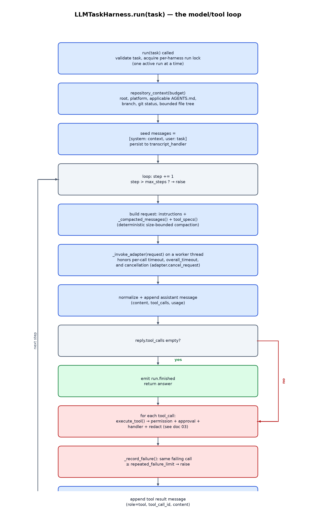

# 02 — Harness core (`LLMTaskHarness`)

`LLMTaskHarness` (`runtime.py`) is the reusable, provider-neutral core: one
repository-scoped model/tool loop, with no FastAPI or durability dependency.

## Construction and configuration surface

The constructor takes one required positional argument (`adapter`, any
`Callable[[dict], Mapping]`) and a large set of keyword-only limits and
hooks, all with safe defaults:

- **Identity/behavior**: `root` (resolved and required to exist),
  `model`, `instructions` (defaults to a built-in system prompt describing
  the expected agent behavior — inspect before assuming, obey `AGENTS.md`,
  prefer patches, verify before claiming success, ask only when necessary).
- **Permissions**: `permission_profile` (`read-only` by default),
  `allow_shell`, `allow_network`, `allowed_hosts` (required non-empty if
  `allow_network=True`), `readable_paths`/`writable_paths` (both default to
  `(".",)`, i.e. the whole repository), `denied_globs` (defaults to
  `DEFAULT_DENIED_GLOBS`: `.git`, `.env*`, private keys, credentials).
- **Limits**: `max_steps` (50), `timeout` (per model call, 120s),
  `overall_timeout` (whole run, optional), `max_output_bytes`,
  `max_file_bytes`, `max_download_bytes`, `max_context_bytes`,
  `max_message_bytes`, `subagent_limit`, `repeated_failure_limit` (3).
- **Extensibility hooks**: `approval`, `event_handler`, `input_handler`,
  `transcript_handler`, `web_search_adapter`, `persistence_file`, `redact`,
  `test_command`. These are exactly the seams `HarnessTaskManager` uses to
  turn a synchronous harness into an asynchronous, durable, approval-gated
  task (see doc 05) — an embedder can supply the same hooks directly
  without ever going through the task manager.

Construction also calls `_register_builtin_tools()` (doc 03) and emits a
`harness.created` event. A harness is a context manager (`with
LLMTaskHarness(...) as agent:`), and `close()`/`cancel()` are idempotent and
safe to call from another thread while a run is in progress.

## The `run()` loop

`run(task)` is guarded by a non-reentrant `threading.Lock` (`_run_lock`) —
a harness can have only one active run at a time; calling `run()` again
while one is in flight raises immediately rather than corrupting shared
state. Each call:

1. Validates the task text and its encoded size against
   `max_message_bytes`.
2. Builds the **repository context** (below) inside a byte budget derived
   from `max_context_bytes` minus the task's own encoded size, then seeds
   `messages` with `[system: context, user: task]`. This pair's index is
   recorded as `_run_anchor_index` — it is the "mandatory" prefix that
   context compaction (below) is never allowed to drop.
3. Loops: increment `step`, raise once `step > max_steps`, build a request
   (`instructions` + `_compacted_messages()` + `tool_specs()`), call
   `_invoke_adapter(request)`, append the normalized assistant message.
4. If the reply has no `tool_calls`, emit `run.finished` and return the
   content as the answer.
5. Otherwise, execute every requested tool call in order via
   `execute_tool()` (doc 03), feed `_record_failure()` (below), append a
   `role: tool` result message per call, and loop back to step 3.

Any exception anywhere in the loop is caught once at the top level, emits
`run.failed`, and re-raises — so an embedder or `HarnessTaskManager` always
sees a single well-defined failure path.

### Repository context assembly

`repository_context(budget)` builds the mandatory system message from:

- Fixed facts: repository root, `platform.platform()`, Python version,
  the active permission profile.
- Every applicable `AGENTS.md` found under the root via `rglob`, filtered
  to those that are (a) not denied by policy and (b) inside a directory the
  harness can actually read (`_instruction_applies_to_readable_scope`) —
  this is what lets a nested task root still inherit ancestor instructions
  without pulling in irrelevant sibling instructions.
- Best-effort *optional* context appended only if it fits the remaining
  budget: current branch, `git status`, and a bounded file tree (via the
  `list_files` tool itself, capped at 300 entries).

Critically, the *mandatory* portion (facts + applicable `AGENTS.md` +
optional `extra_context` from an ancestor scope) is checked against the
budget **before** anything is read from disk into memory, and raises
`ValueError` rather than silently truncating instructions if it doesn't
fit — a task is never allowed to start with a truncated, misleading
`AGENTS.md`. Only the *optional* section (branch/status/file tree) is
byte-sliced to fit whatever budget remains.

### Deterministic context compaction

`_compacted_messages()` runs on every model call, not just when a hard
limit is hit, so behavior is exactly reproducible:

1. If the whole message history already fits `max_context_bytes`, return
   it unchanged.
2. Otherwise the mandatory anchor pair (the system context + user task
   recorded at the start of the current `run()`) is **always** kept; if
   even that pair doesn't fit the budget, this is a hard configuration
   error (`RuntimeError`/`ValueError`), never a silent drop.
3. The remaining messages are grouped into **turns** — one assistant
   message plus the tool-result messages that immediately follow it — and
   turns are added back **newest-first** until the next-oldest turn would
   exceed the budget.
4. If any messages were dropped, a single synthetic `system` message is
   inserted noting how many earlier messages remain in the durable
   transcript (they are never actually deleted — see `_persist_many`/doc
   01) — so the model knows compaction happened instead of silently seeing
   a shorter conversation.
5. If even the single newest complete turn doesn't fit alongside the
   mandatory pair, that's also a hard error rather than truncating a
   half-turn.

This guarantees a model call never silently loses the current task, the
applicable repository instructions, or a partially-applied tool call.

### Adapter invocation, timeouts, and cancellation

`_invoke_adapter()` runs the adapter on a dedicated daemon thread and polls
a result queue in a loop bounded by `min(0.1, remaining)`, so it can react
promptly to three independent stop conditions without blocking on the
adapter itself:

- **Per-call timeout** (`timeout`, default 120s) — raises `TimeoutError`.
- **Overall run timeout** (`overall_timeout`, optional) — raises
  `TimeoutError`.
- **Cooperative cancellation** (`harness.cancel()` sets `self.cancelled`) —
  raises `RuntimeError`.

In every case the harness first asks the adapter to stop cooperatively:
if it exposes `cancel_request(cancellation_event)` (the recommended,
per-call-scoped contract), only that one in-flight request is aborted; if
it only exposes a whole-adapter `cancel()`, that stops *every* in-flight
call from that adapter, which is why `_tool_subagents` deliberately falls
back to running subagents **serially** (`safe_workers = 1`) when the
adapter only supports the coarse `cancel()` — see doc 03. If an adapter
honors neither, the harness still raises once its own deadline passes, but
the adapter thread itself is a daemon thread left running in the
background; a non-cooperative in-process Python callable cannot be safely
killed, which is why the README calls this out as a requirement for a
"killable process boundary" adapter.

`cancel()` itself is idempotent and does more than flip a flag: it
terminates every tracked child process (via `_terminate_process_tree`,
psutil-based with a plain `Popen` fallback), aborts every tracked network
resource, propagates to every child subagent harness, and requests adapter
cancellation — all while holding `self._lock` only long enough to snapshot
the resources, so it never deadlocks against a thread that is itself
waiting on that lock.

### Repeated-failure circuit breaker

`_record_failure()` hashes `(tool name, arguments, error type)` for every
failing tool result and raises once the identical failing call has been
seen `repeated_failure_limit` (default 3) times in the current run. This
stops a model from looping forever retrying the exact same doomed tool
call — a distinct guard from `max_steps`, which only bounds total steps
regardless of whether they're making progress.

## State, capabilities, and manual persistence

- `state()` returns a snapshot dict (id, root, model, profile, step,
  cancelled/closed flags, current task, message count, plan) safe to poll
  from another thread.
- `capabilities()` returns every registered tool's JSON schema + risk, the
  known permission profiles, and a human-readable feature list — this is
  what backs `GET /coplex_stdpy/capabilities`.
- `save(path)` / `restore(path)` snapshot or reload the in-memory message
  list and plan as JSON, independent of `HarnessTaskManager`'s own
  transcript persistence (doc 01) — a convenience for embedders managing
  their own save points.
- `reset()` clears messages/plan/step/failure-counts to reuse a harness for
  a fresh task, but refuses to run while a run is active or while adapter
  threads/subagents are still alive, so it can never race a still-running
  loop.
