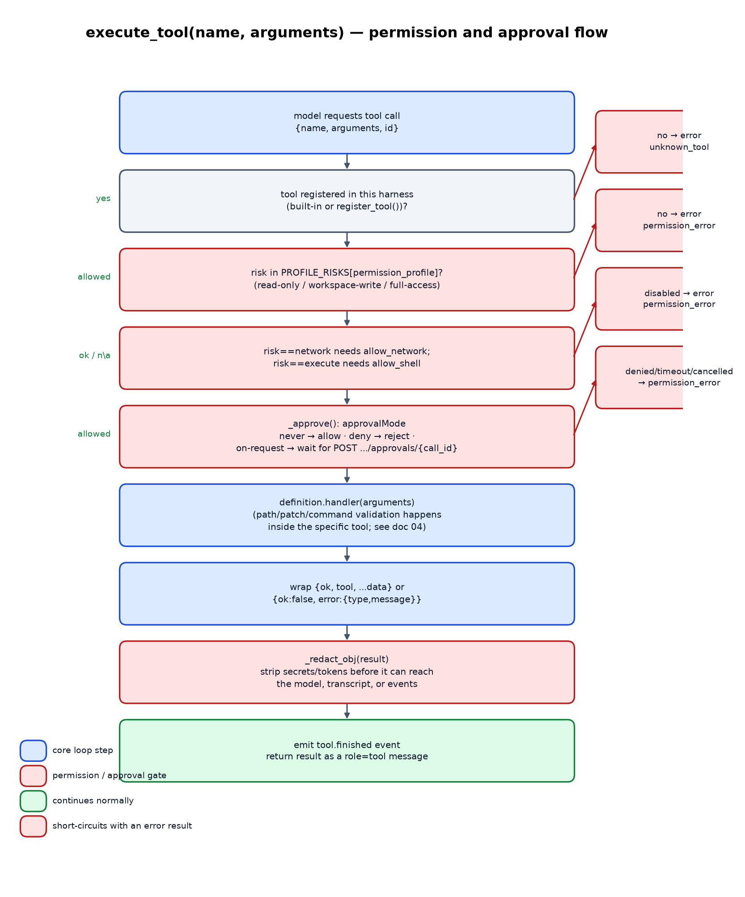

# 03 — Tools and permissions

## The risk taxonomy

Every tool — built-in or dynamically registered via `register_tool()` — is
tagged with exactly one risk category:

| Risk | Meaning | Gated by |
|---|---|---|
| `read` | Reads repository state; cannot mutate anything. | Permission profile only. |
| `write` | Mutates the repository filesystem. | Permission profile + approval. |
| `execute` | Runs a host process (test command or approved program). | Permission profile + `allow_shell` + approval. |
| `network` | Makes an outbound HTTP(S) call. | Permission profile + `allow_network` + allowed-host list + approval. |
| `state` | Mutates harness-local bookkeeping (plan, pending input) — never the repository or host. | Permission profile only. |
| `model` | Invokes the adapter again (subagents). | Permission profile only. |

Permission **profiles** are just named sets of allowed risk categories
(`LLMTaskHarness.PROFILE_RISKS`):

| Profile | Allowed risks |
|---|---|
| `read-only` | `read`, `state`, `model` |
| `workspace-write` | `read`, `write`, `execute`, `state`, `model` |
| `full-access` | `read`, `write`, `execute`, `network`, `state`, `model` |

Note that `network` tools require `full-access` *and* the separate
`allow_network`/`allowed_hosts` construction flags — a profile alone never
enables network access.

## Built-in tool catalog

Registered by `_register_builtin_tools()`; every tool's JSON schema also
sets `additionalProperties: False`, so an adapter cannot smuggle
unexpected fields into a tool call.

| Tool | Risk | Parameters | Notes |
|---|---|---|---|
| `read_file` | read | `path*`, `start_line`, `end_line` | UTF-8 only; rejects files over `max_file_bytes`; supports a line-range slice. |
| `list_files` | read | `path`, `glob`, `limit` | Recursive listing, denied-glob-filtered, sorted, capped at 10,000. |
| `search` | read | `query*`, `path`, `glob`, `case_sensitive`, `regex`, `limit` | Prefers `rg` (ripgrep) with denied globs excluded and `--fixed-strings` unless `regex` is set; falls back to a pure-Python fixed-text scan (never regex) if `rg` is absent. |
| `file_info` | read | `path*` | Type, size, mtime, POSIX mode bits. |
| `git_status` / `git_diff` / `git_log` / `git_show` | read | see below | Read-only Git inspection, always scoped to the harness's readable paths (see below). |
| `write_file` | write | `path*`, `content*` | Atomic (`tempfile` + `os.replace` + `fsync`); preserves the previous file's mode bits if it already existed. |
| `apply_patch` | write | `patch*` | Validates every path named in the unified diff before applying; see doc 04. |
| `make_directory` | write | `path*` | `mkdir(parents=True, exist_ok=True)` inside the writable scope. |
| `shell` | execute | `command*`, `args`, `timeout` | Direct `Popen([command, *args])` — **no shell interpreter is ever invoked**; see doc 04 for the command policy. |
| `run_tests` | execute | `command`, `args`, `timeout` | Uses an explicit command, the configured `test_command`, or `_detect_test_command()` (pytest/npm/cargo/go/make, by marker file) in that order; non-zero exit is a normal (not exceptional) result. |
| `web_get` | network | `url*` | SSRF-guarded fetch; see doc 04. |
| `web_search` | network | `query*`, `limit` | Delegates entirely to an injected `web_search_adapter`; raises if none is configured. |
| `download` | network | `url*`, `path*` | Streams into the writable scope, capped at `max_download_bytes`. |
| `subagents` | model | `tasks*`, `instructions` | Bounded, forced read-only, isolated child harnesses; see below. |
| `update_plan` | state | `plan*`, `explanation` | Replaces the plan list; enforces at most one `in_progress` step. |
| `request_user_input` | state | `prompt*`, `context` | Blocks on `input_handler`; raises if none is configured. |

`git_status`/`git_diff`/`git_log` always pass explicit pathspecs
(`_git_readable_pathspecs()` + `_git_exclusion_pathspecs()`), so Git output
can never reveal the *contents* of a denied path even though Git itself
sees the whole repository — see doc 04. `git_show` restricts the object
name to a strict pattern and verifies it resolves to a commit before
showing it, so it cannot be abused to reach into blob/tree internals or
inject extra `git` flags via the object argument.

## `execute_tool()`: the permission and approval gate

Every tool call — whether the model requested it inside `run()` or an
embedder calls `execute_tool()` directly — goes through the same gate:

1. **Existence**: unknown tool names fail closed with `unknown_tool`.
2. **Profile check**: `definition.risk` must be in
   `PROFILE_RISKS[self.permission_profile]`.
3. **Feature flags**: `network` additionally requires `allow_network`;
   `execute` additionally requires `allow_shell`. A profile can permit the
   *category* while construction-time flags still keep the *capability*
   off — this is the knob `HarnessTaskManager` uses to derive `allow_shell`
   straight from the profile while keeping `allow_network` a separate,
   administrator-controlled switch (doc 05).
4. **Approval** (`_approve()`, only for tools whose risk isn't
   unconditionally allowed by the configured `approval` callable):
   returning `True`/`"allow"` proceeds; anything else raises
   `PermissionError` with the given reason. `HarnessTaskManager` wires this
   to `never` (auto-allow), `deny` (auto-reject), or `on-request` (block
   the task until a human calls the approvals HTTP endpoint) — see doc 05.
5. **Execution**: the tool's handler runs; both successful results and
   caught exceptions are wrapped into a uniform `{"ok": ..., ...}` result
   shape rather than propagating raw exceptions back into the model loop.
6. **Redaction**: `_redact_obj()` recursively replaces any dict key whose
   name contains `secret`/`token`/`password`/`authorization`/`api_key`
   with `"[REDACTED]"`, and additionally substring-replaces every
   configured `redact` string (e.g. the live API key value) anywhere it
   appears in text — applied before the result reaches the model, the
   event stream, or the transcript.
7. **Event + return**: a `tool.finished` event is emitted and the (redacted)
   result is returned as the tool's HTTP-facing result and fed back into
   `run()` as a `role: tool` message.

## Bounded, isolated, read-only subagents

The `subagents` tool (`_tool_subagents`) is the harness's only way to
recurse into another model/tool loop:

- Accepts up to 32 independent task strings; each spawns its own child
  `LLMTaskHarness` sharing the same `root`, `adapter`, and `redactions`,
  but constructed fresh — **not** a shared mutable child, so one
  subagent's message history can never leak into another's or into the
  parent's.
- The child is **hard-forced** to `permission_profile="read-only"` and
  `writable_paths=()` regardless of the parent's profile, and its tool set
  is further filtered down to `subagent_tools ∩ READ_ONLY_SUBAGENT_TOOLS`
  (`read_file`, `list_files`, `search`, `file_info`,
  `git_status`/`git_diff`/`git_log`/`git_show`, `web_get`) — a subagent
  can inspect the repository but can never write, execute, or recurse
  again (`subagent_limit=1`, `subagent_tools=()` on the child).
- Concurrency is bounded by `min(subagent_limit, len(tasks))` workers in a
  dedicated `ThreadPoolExecutor` — **unless** the parent's adapter only
  exposes a whole-adapter `cancel()` (no per-request
  `cancel_request()`), in which case subagents are forced to run
  **serially** (`safe_workers=1`). Otherwise cancelling one subagent's
  in-flight model call could cancel every sibling sharing that adapter —
  see doc 02.
- The parent's own cancellation propagates to every live child
  (`self._children`), and each child's `overall_timeout` is derived from
  the parent's *remaining* overall timeout, so a slow subagent cannot let
  the whole task run past its configured deadline.
- Results are collected in task order (not completion order) as
  `{"ok": True, "content": ...}` or `{"ok": False, "error": ...}` per task,
  so a single failing subagent never aborts the others.

## The plan and human-input tools

`update_plan` and `request_user_input` are tagged `state` risk precisely
because they never touch the repository or the host — they only mutate
harness-local bookkeeping (`self.plan`) or block on an injected
`input_handler`. `update_plan` enforces "at most one `in_progress` step" so
a plan can't claim to be doing two things at once; `request_user_input`
raises immediately if no `input_handler` was configured, rather than
hanging forever — `HarnessTaskManager` supplies one that flips the task to
`waiting_input` and blocks on a condition variable until a human responds
over HTTP (doc 05).
