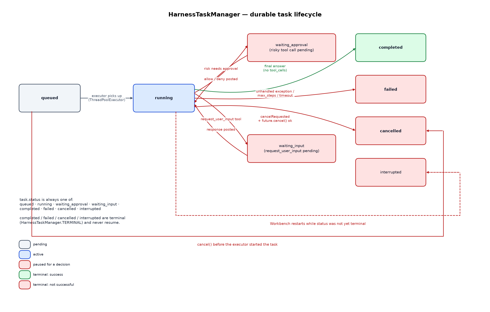

# 05 — Task manager and HTTP API

`HarnessTaskManager` turns the synchronous `LLMTaskHarness.run()` call into
a durable, asynchronous, approval-gated task, and `coplex_stdpy.server`
(loaded via the repository-root `plugin.py` shim) exposes it as a Workbench
FastAPI router plus a native admin settings page.

## Submission and policy enforcement

`submit(body)` is the single choke point for every safety policy in the
plugin manifest, checked in this order before a harness is ever
constructed:

1. `executionEnabled` must be `true` (the shipped default is `false`) —
   otherwise `PermissionError` (→ HTTP 403).
2. `task` must be non-empty text; `root` must resolve to a directory inside
   the repository, not already denied by policy, and not inside the
   harness's own state directory (`_task_root`) — otherwise `ValueError`
   (→ HTTP 400) or `PermissionError` (→ HTTP 403).
3. The requested `permissionProfile` must be a known profile, and its rank
   (`PERMISSION_RANK`: `read-only` < `workspace-write` < `full-access`)
   must not exceed the configured `maximumPermissionProfile` — otherwise
   `PermissionError`. This is the administrator ceiling: the shipped
   manifest sets both the default *and* the maximum to `workspace-write`,
   so no API caller can reach `full-access` until an administrator raises
   the ceiling.
4. The requested `approvalMode` must be a known mode, and `never` is only
   accepted if `allowApprovalNever` is enabled in policy — otherwise
   `PermissionError`.

Only after all four checks pass does `submit()` create a `queued` record,
persist it, append a `task.queued` event, and hand `_run_record(task_id)`
to the `ThreadPoolExecutor` — returning immediately with the queued
record's public view.

## Task lifecycle

`task.status` is always exactly one of `queued`, `running`,
`waiting_approval`, `waiting_input`, `completed`, `failed`, `cancelled`, or
`interrupted` — the last four are terminal (`HarnessTaskManager.TERMINAL`)
and never resume. `_run_record()` builds the actual `LLMTaskHarness` for a
queued task, deriving its limits directly from plugin settings:
`max_steps`/`modelTimeoutSeconds`/`taskTimeoutSeconds` are clamped into
sane ranges, `allow_shell` is simply `permissionProfile != "read-only"`
(so `workspace-write` and `full-access` both get process execution, gated
further by the approval mode), `allow_network`/`allowedHosts` come from the
separate `allowToolNetwork`/`allowedHosts` settings — but network tools are
still only reachable when the profile itself is `full-access`, since
`network` risk is absent from `PROFILE_RISKS["workspace-write"]`; enabling
`allowToolNetwork` alone does not open network tools to a `workspace-write`
task — and `denied_globs` is extended with the harness's own state directory so a
task can never read or write its own control-plane files
(`_task_denied_globs`). The provider API key's live value is always added
to `redact`.

- **queued → running**: picked up by the executor; a task cancelled while
  still queued (before its worker thread started) is marked `cancelled`
  directly via `future.cancel()` without ever constructing a harness.
- **running → waiting_approval / waiting_input**: the harness's `approval`
  or `input_handler` callback blocks the *harness's own worker thread* on
  `self._condition.wait(...)`, and the record's status is set so `GET
  /tasks/{id}` reflects it immediately for any concurrent poller.
- **waiting_approval → running**: `POST .../approvals/{call_id}` with
  `{"decision": "allow"|"deny"}` resolves the pending approval and wakes
  the waiting thread — see below.
- **waiting_input → running**: `POST .../input` with `{"response": "..."}`
  resolves the pending prompt the same way.
- **running → completed**: `harness.run()` returned an answer with no
  cancellation pending.
- **running → failed**: any unhandled exception (adapter error, exceeded
  `max_steps`, per-call or overall timeout, repeated-failure circuit
  breaker) that isn't itself a cancellation.
- **running → cancelled**: `cancelRequested` was set (via `POST
  .../cancel`) and the harness's `run()` unwound because of it.
- **(restart) → interrupted**: covered by `_load_records()` in doc 01 —
  any record that was not terminal when the Workbench process last shut
  down is rewritten to `interrupted` on the next startup, so a crash or
  restart is reported explicitly instead of leaving a task looking like it
  is still running forever or, worse, silently marked `completed`.

## Approvals and human-input pauses

Both `_approval_handler` and `_input_handler` follow the same pattern,
built on `self._condition` (a `threading.Condition` wrapping the manager's
lock):

1. Record the pending approval/input on the task record and flip its
   status to `waiting_approval`/`waiting_input`; append the corresponding
   `*.requested` event.
2. Loop on `self._condition.wait(timeout=min(0.5, remaining))` until either
   the pending item is resolved or `cancelRequested` is set, recomputing
   `_remaining_task_seconds()` (bounded by `taskTimeoutSeconds`, measured
   from the task's actual `startedAt`) on each iteration.
3. If the *task's own timeout* elapses while still waiting, the approval is
   marked `expired` (or the pending input cleared) and a `TimeoutError` is
   raised back into the harness — so a task can never wait forever for a
   human who never responds; it fails like any other timeout would.
4. If cancellation arrives first, an approval resolves to a deny
   (`("deny", "task was cancelled")`) and a pending input raises
   `RuntimeError` — either way the harness's own run unwinds through its
   normal error path.

`decide_approval`/`provide_input` are the only two ways to resolve a
pending item, and both explicitly reject decisions against a task that is
already terminal or already cancel-requested — an approval can't be
granted after the fact to a task that has already moved on.

## HTTP API (`coplex_stdpy/server.py`)

All routes are mounted under the manifest's `routePrefix`
(`/coplex_stdpy`) and every manager call is wrapped so that
`KeyError`/`PermissionError`/`ValueError`/etc. map to the right status code
(`_http_error`):

| Method | Route | Maps to |
|---|---|---|
| `GET` | `/coplex_stdpy` | Same-origin HTML task console (`static/console.html`), served with a restrictive CSP. |
| `GET` | `/coplex_stdpy/endpoints` | Plugin summary: execution/policy settings, per-status task counts, related links. |
| `GET` | `/coplex_stdpy/health` | Liveness + active/stored task counts. |
| `GET` | `/coplex_stdpy/capabilities` | `HarnessTaskManager.capabilities()` — tool schemas/risks, profiles, features, task states. |
| `GET` | `/coplex_stdpy/models` | Proxies `OpenAICompatibleAdapter.list_models()` against the configured endpoint. |
| `POST` | `/coplex_stdpy/tasks` | `submit()` → `202 Accepted` with the queued record. |
| `GET` | `/coplex_stdpy/tasks` | `list(limit)`, newest first. |
| `GET` | `/coplex_stdpy/tasks/{id}` | `get(id)`. |
| `GET` | `/coplex_stdpy/tasks/{id}/events?after=N` | `events(id, after=N)` — cursor-based polling by `sequence`. |
| `POST` | `/coplex_stdpy/tasks/{id}/cancel` | `cancel(id)`. |
| `POST` | `/coplex_stdpy/tasks/{id}/approvals/{call_id}` | `decide_approval(id, call_id, decision)`. |
| `POST` | `/coplex_stdpy/tasks/{id}/input` | `provide_input(id, response)`. |
| `POST` | `/coplex_stdpy/admin/shutdown` | Calls the registered shutdown hook, if any; `501` otherwise (see below). |
| `POST` | `/coplex_stdpy/admin/restart` | Calls the registered restart hook, if any; `501` otherwise (see below). |

### Process-control hooks (`/admin/shutdown`, `/admin/restart`)

`create_router()` keeps a module-level `_process_control` registry with
`"shutdown"`/`"restart"` slots, both `None` by default — in that default
state the two routes above always answer `501 Not Implemented`. A process
that actually owns the running ASGI server calls
`register_process_control(shutdown=..., restart=...)` to wire real
behavior; this is deliberately opt-in rather than automatic, because
`create_router()`'s router can be mounted inside a much larger host
application (for example the Workbench API process itself), and a request
to this plugin's own routes must never be able to take that host down.

`coplex_stdpy.standalone.main()` is the one thing that registers real hooks
automatically, since it is the process that constructs the `uvicorn.Server`:

- `shutdown` sets `uvicorn.Server.should_exit = True`. uvicorn's serve loop
  polls that flag and then runs the FastAPI app's `shutdown` event handler
  (which closes the `HarnessTaskManager`) before the process exits — a
  graceful stop, not a hard kill.
- `restart` does the same on a background thread, then polls
  `is_listening()` until the port is confirmed free and calls
  `launch()` to spawn a fresh detached replacement process. Running this on
  a background thread means the HTTP request that triggered it still gets
  a `200 {"ok": true, "action": "restart"}` acknowledgement instead of a
  connection reset mid-restart.

`create_admin_router()` additionally publishes a native Workbench admin
descriptor (`GET /coplex_stdpy/admin` for the current settings/status
view, `PUT /coplex_stdpy/admin/settings` to update them) covering every
policy knob from the manifest: execution enable/disable, default/maximum
permission profile, default approval mode, `allowApprovalNever`,
`allowToolNetwork` + `allowedHosts`, the model provider's base URL/model
name/API-key env var, and the numeric limits (`maxWorkers`, `maxSteps`,
timeouts). Changing these at runtime calls
`HarnessTaskManager.update_settings()`, which only ever affects *new*
`submit()` calls — an already-running task keeps the settings it was
constructed with.

## The task console (`static/console.html`)

`GET /coplex_stdpy` serves a small, dependency-free, dark-themed
single-page console (inline CSS/JS only, served with a CSP that only
permits `'self'`) that drives the HTTP API above: it lists tasks with live
status, lets an operator submit a new task (text, root, model, profile,
approval mode), polls `.../events?after=N` for ordered event streaming,
and surfaces pending approvals/input requests with inline allow/deny and
response controls plus a cancel button. It contains no sample task records
or mocked output — everything it shows comes from the same HTTP surface
any other client would use (it loads its own summary from
`GET /coplex_stdpy/endpoints`).
